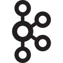

# i9chat (API Server)

Build your Chat Application

## Intro

i9chat-server is a REST API server for a Chat Application, built in Go. It supports major chat application features that can be used to implement a mordern chat application.

### Who is this project for?

If you're a frontend developer looking to build a Chat Application UI, not just to have it static, but to also make it function.

The goal of this API server is to support as many Chat Application features as possible.

The API documentation provides a detailed integration guide. It doesn't follow the Open API specification, rather it follows Google's API documentation style sturcured in a simple markdown table, which I consider easier to work with.

### Open to suggestions

If you need a feature this API server does not currently support, feel free to suggest them, and it will be added as soon as possible.

## Technologies

### More

- WebSockets
- Gofiber
- JWT
- ozzo-validator

## Table of Contents

- [Intro](#intro)
- [Technologies](#technologies)
- [Table of Contents](#table-of-contents)
- [Features](#features)
- [API Documentation](#api-documentation)
- [Notable Features and their Algorithms](#notable-features-and-their-algorithms)
- [Building & Running the Application (Locally)](#building--running-the-application-locally)
- [Deploying the Application](#deploying-the-application)

## Features

## API Documentation

## Notable Features and their Algorithms

## Building & Running the Application (Locally)

## Deploying the Application
